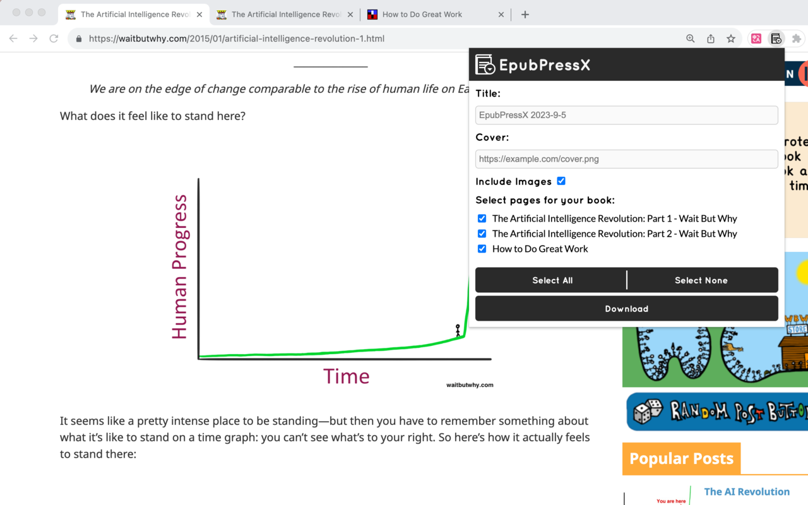

# EpubPressX
A browser extension that converts web pages into epub/txt e-books. Works on all Chromium-based browsers (Chrome, Brave, Edge, Firefox, etc.); the generated books can be imported into WeChat Reading and other readers.

> Note: The EpubPressX already on the Chrome Store is the original author's (haroldtreen) release. This repository is a customized fork (local EPUB generation) and is not yet on the store. To install this version, use "Load unpacked" in Developer Mode — see "Local development" below.

## Features

- Generate **EPUB** or **TXT** e-books from web pages (generated locally, no server needed)
- Merge multiple tabs into one book
- Automatic pagination (merges multi-page articles)
- Automatic table of contents (TOC)
- Auto-generate book title
- Custom cover support
- Option to include or exclude images
- Strips ad/recommendation links and bare URLs from export, preserving article text, title and author
- Bilingual UI (English / 简体中文)
- Firefox compatible (Manifest V3 + gecko settings)

## Preview



## How it works
By packaging files into the epub format as required, an epub file becomes an e-book.

epub format structure

```
--ZIP Container--
mimetype
META-INF/
  container.xml
OEBPS/
  content.opf
  chapter1.xhtml
  ch1-pic.png
  css/
    style.css
    myfont.otf
```

packaging 

```sh
cd "folder of epub content"

# add mimetype 1st
zip -0 -X ../file.epub mimetype

# add the rest
zip -9 -X -r -u ../file.epub *
```

Reference 
[wikipedia](https://en.wikipedia.org/wiki/EPUB#Version_3.0.1),
[w3 standard](https://www.w3.org/TR/epub-33/)

## Local development

```sh
cd packages/epub-press-chrome
npm install
npm run build        # development build
npm start            # build + watch
npm run build-prod   # production build
```

Load the unpacked extension:
1. Run `npm run build` (or `npm run build-prod`)
2. Open `chrome://extensions`, enable Developer Mode
3. Click "Load unpacked" and select `packages/epub-press-chrome/app/`

Run tests:
```sh
npm test                              # dev-server + interactive browser tests
node run-browser-tests.mjs            # headless browser tests (Brave/Chrome)
node --test node-strip-test.mjs       # Node-native tests
```

## Fork source
Fork from https://github.com/haroldtreen/epub-press-clients

The epub files generated by the original project had display issues on WeChat Reading, so a fork was made and some updates were made:
- Faster and more stable: e-books are created locally, not dependent on the server
- Fixed EPUB format issues
- Fixed image positioning issues
- Can set the cover
- Can choose whether to include images
- Automatic pagination and table of contents
- Strips ad/recommendation links and bare URLs from exported content
