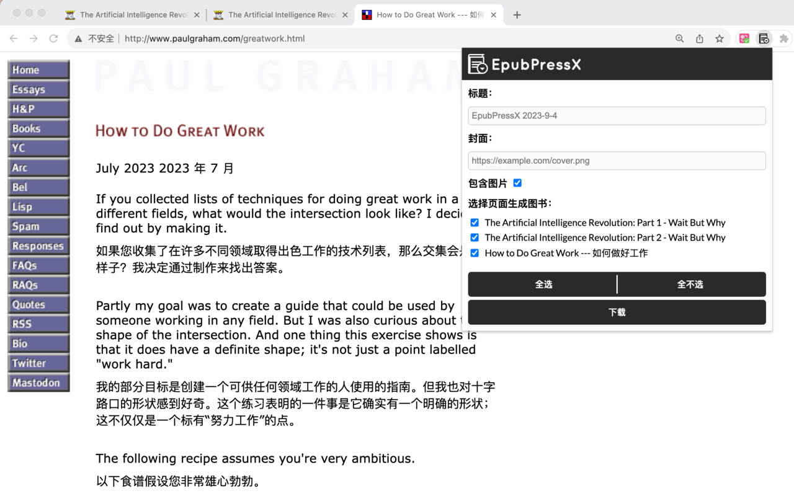
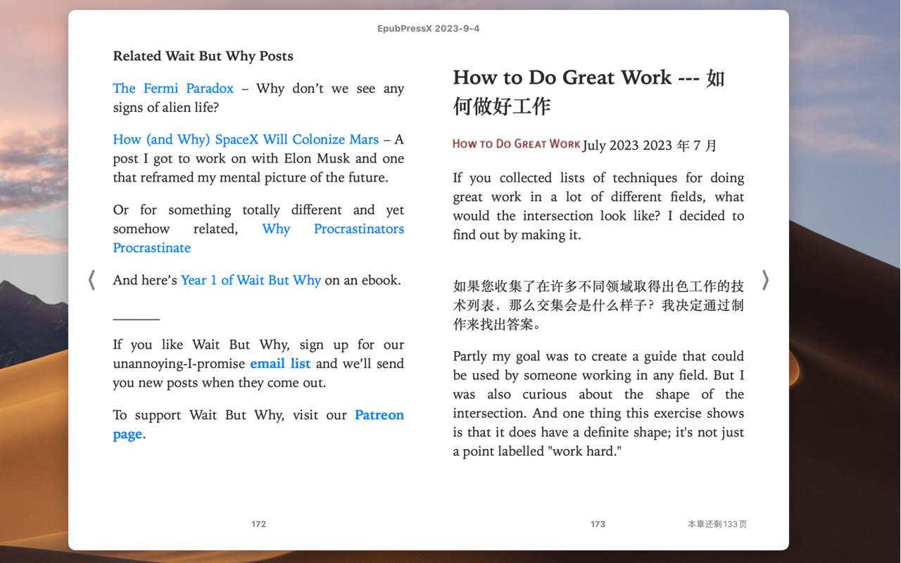

[English](README.en.md)

# EpubPressX
一个浏览器扩展，可以将网页制作成 epub/txt 电子书。支持所有 Chromium 内核浏览器（Chrome、Brave、Edge、Firefox 等），生成的电子书可导入微信读书等阅读器。

> 注意：Chrome 商店里已有的 EpubPressX 是原作者（haroldtreen）发布的版本；本仓库是定制分支（本地生成 EPUB），尚未上传商店。如需安装本版本，请使用「开发者模式加载已解压的扩展程序」方式，见下方「本地开发」。

配合 [沉浸式翻译](https://chrome.google.com/webstore/detail/immersive-translate/bpoadfkcbjbfhfodiogcnhhhpibjhbnh)  插件可以制作双语电子书。

## 功能

- 将网页制作成 **EPUB** 或 **TXT** 电子书（本地生成，无需服务器）
- 支持多标签页合并成一本书
- 自动分页抓取（多页文章自动合并）
- 自动生成目录（TOC）
- 自动生成书名
- 可设置封面
- 可选择是否包含图片
- 自动剔除广告/推荐链接与裸网址文字，保留正文、标题和作者
- 支持中英文界面
- 兼容 Firefox（Manifest V3 + gecko 设置）

## 效果预览



## 原理
按照 epub 要求的格式，将文件打包成 epub 文件，就是一本电子书了。

epub 格式结构

```
--ZIP Container--
mimetype
META-INF/
  container.xml
OEBPS/
  content.opf
  chapter1.xhtml
  ch1-pic.png
  css/
    style.css
    myfont.otf
```

打包 

```sh
cd "folder of epub content"

zip -9 -X -r -u ../file.epub *
```

参考 
[wikipedia](https://en.wikipedia.org/wiki/EPUB#Version_3.0.1),
[w3 standard](https://www.w3.org/TR/epub-33/)

## 本地开发

```sh
cd packages/epub-press-chrome
npm install
npm run build        # 开发构建
npm start            # 构建 + 监听
npm run build-prod   # 生产构建
```

加载未打包扩展：
1. 运行 `npm run build`（或 `npm run build-prod`）
2. 打开 `chrome://extensions`，开启开发者模式
3. 点击「加载已解压的扩展程序」，选择 `packages/epub-press-chrome/app/`

运行测试：
```sh
npm test                              # dev-server + 浏览器交互测试
node run-browser-tests.mjs            # 无头浏览器自动测试（Brave/Chrome）
node --test node-strip-test.mjs       # Node 原生测试
```

## Fork 来源
Fork from https://github.com/haroldtreen/epub-press-clients

原项目生成的 epub 文件在微信读书上显示有问题，所以 fork 了一份，并进行了一些更新：
- 更快更稳定：本地创建电子书，而不是依赖于服务器
- 修复了 EPUB 格式的问题
- 修复了图片位置的问题
- 可以设置封面
- 可选择是否包含图片
- 自动分页抓取与目录生成
- 导出时剔除广告/推荐链接与裸网址文字
